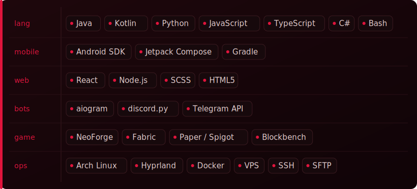

 

> `>` Full-spectrum developer &amp; server operator. I ship **Android apps** (Java · Kotlin), **Telegram / Discord bots** (Python), **web apps** (React · TypeScript), **Minecraft mods &amp; plugins** (NeoForge · Fabric · Paper), desktop tools in **C#**, and I run &amp; harden **Unix servers**.
>
> `>` Founder of **UnderNet VPN** — bypass tooling that actually works.

<table>
<tr>
<td width="72" align="center"></td>
<td>
<b><a href="https://undernetvpn.com">UnderNet VPN</a></b>&nbsp;&nbsp;&nbsp;TypeScript · Kotlin · Shell
 
Anti-censorship VPN — VLESS / Trojan / WS auto-deploy, desktop &amp; mobile clients. → <a href="https://undernetvpn.com">undernetvpn.com</a>
</td>
</tr>
<tr>
<td width="72" align="center"><samp>▤</samp></td>
<td>
<b><a href="https://github.com/AlexFirst404/CONTROLGUI">CONTROLGUI</a></b>&nbsp;&nbsp;JavaScript · Node.js
 
Minecraft server panel (Vanilla / Paper / Purpur / Folia / Forge) — console, monitoring, file manager, zero deps.
</td>
</tr>
</table>

