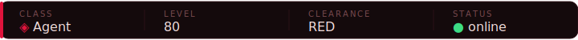
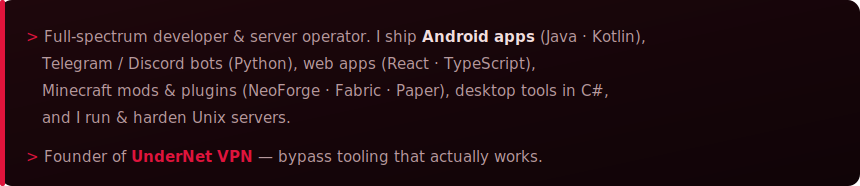
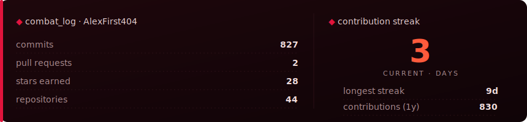
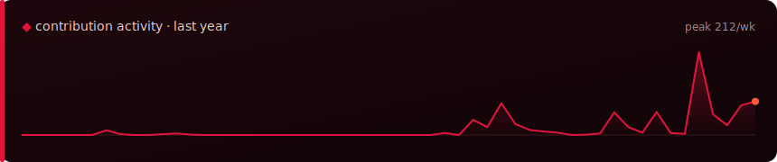

<table>
<tr>
<td width="80" align="center"></td>
<td>
<b><a href="https://undernetvpn.com">UnderNet VPN</a></b>
 
Anti-censorship VPN — VLESS / Trojan / WS auto-deploy, desktop &amp; mobile clients. → <a href="https://undernetvpn.com">undernetvpn.com</a>
</td>
</tr>
</table>

